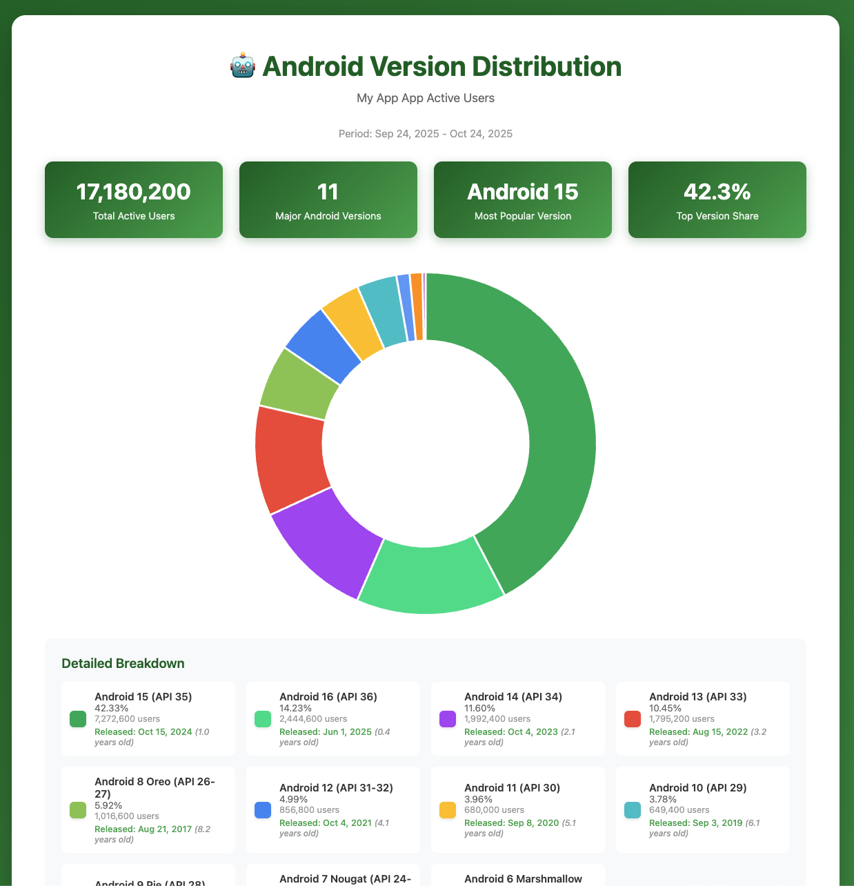

# 🤖 Android Version Distribution Analyzer

Self-contained tool to fetch, analyze, and visualize Android version distribution for my-app active users from Google Analytics.

[](docs/screenshot.png)

## 🚀 Quick Start

**Everything you need is in this folder!**

### 1. Run the data fetcher (once or whenever you want fresh data)

```bash
./run.sh
```

This will:
- ✅ Create a Python virtual environment (if needed)
- ✅ Install dependencies (if needed)
- ✅ Fetch latest Android version data from Google Analytics
- ✅ Generate `android_versions_report.csv`
- ✅ Update the visualization with embedded data

### 2. View the visualization

```bash
open index.html
```

Or simply **double-click `index.html`** in Finder.

### 3. Refresh anytime

Run `./run.sh` again to fetch fresh data, then refresh the page in your browser!

## 📂 Files

This folder contains everything needed to run independently:

- **`index.html`** - Interactive visualization (self-contained, works offline)
- **`run.sh`** - Main script to fetch data and update visualization
- **`fetch_android_versions.py`** - Python script to fetch data from Google Analytics
- **`update_html.py`** - Helper script to embed CSV data into HTML
- **`requirements.txt`** - Python dependencies
- **`android_versions_report.csv`** - Generated CSV data (created by run.sh)
- **`venv/`** - Python virtual environment (created automatically)
- **`README.md`** - This file

## 🎨 Features

### Interactive Visualization
- **Beautiful Doughnut Chart** - Animated, interactive pie chart
- **Statistics Cards** - Key metrics at a glance
- **Detailed Legend** - Click to toggle segments on/off
- **Version Release Dates** - Shows when each Android version was released
- **Responsive Design** - Works on desktop and mobile
- **Modern UI** - Material Design colors and smooth animations

### Technical Features
- **Embedded CSV Data** - No CORS issues, works with file:// protocol
- **Self-Contained** - Everything in one HTML file
- **Real-Time Parsing** - Parses and analyzes data in the browser
- **Auto-Grouping** - Groups versions by major version (e.g., 14.0 → Android 14)
- **Percentage Calculation** - Shows distribution percentages

## 📊 How It Works

1. **Data Fetching**: `fetch_android_versions.py` connects to Google Analytics API and downloads Android version data
2. **CSV Generation**: Data is saved as `android_versions_report.csv` with metadata (property ID, date range)
3. **HTML Embedding**: `update_html.py` injects the CSV data directly into `index.html` as a `<script>` tag
4. **Browser Parsing**: JavaScript in the HTML reads the embedded CSV, groups by major version, calculates percentages, and renders the chart

**Result**: A single HTML file that works anywhere, no server required!

## 🔧 Requirements

- **Python 3.7+** - For running the data fetcher
- **Google Analytics Access** - Credentials configured for the my-app property
- **Modern Browser** - Chrome, Firefox, Safari, or Edge for viewing the visualization

## 📝 Detailed Usage

### First Time Setup

1. Make the run script executable:
   ```bash
   chmod +x run.sh
   ```

2. Ensure you have Google Analytics credentials set up (the fetch script will use your configured credentials)

3. Run the script:
   ```bash
   ./run.sh
   ```

### Regular Updates

Just run `./run.sh` whenever you want fresh data:
```bash
./run.sh
```

The script will:
- Use the existing virtual environment
- Fetch the latest data
- Update the visualization automatically

### Viewing the Results

The visualization works in multiple ways:

**Option 1: Double-click** (Easiest)
- Just double-click `index.html` in Finder
- Works immediately, no terminal needed

**Option 2: Command line**
```bash
open index.html
```

**Option 3: Drag and drop**
- Drag `index.html` into your browser window

## 🔍 Data Analysis

The tool automatically:

1. **Parses CSV data** - Reads version numbers and user counts
2. **Extracts major versions** - Groups `14.0`, `14.1` → `Android 14`
3. **Calculates totals** - Sums users per major version
4. **Computes percentages** - Shows distribution as percentages
5. **Sorts by version** - Orders from newest to oldest
6. **Displays metadata** - Shows date range and property ID

### Example Data Flow

```
Raw CSV:
14.0,1523
13.0,987
12.0,432
...

↓ Processing

Major Versions:
Android 14: 1,523 users (45.2%)
Android 13: 987 users (29.3%)
Android 12: 432 users (12.8%)
...

↓ Visualization

Interactive chart + detailed breakdown
```

## 🛠️ Troubleshooting

**Problem**: `./run.sh: Permission denied`
```bash
chmod +x run.sh
```

**Problem**: "Failed to load Android version data" in browser

**Solution**: Make sure you've run `./run.sh` first to generate the data.

**Problem**: Script fails to fetch data from Google Analytics

**Solution**: Check your Google Analytics credentials and API access.

**Problem**: Chart doesn't update after running the script

**Solution**: Hard refresh the page (Cmd+Shift+R on Mac, Ctrl+Shift+R on Windows/Linux).

## 📈 Data Source

- **Source**: Google Analytics 4 (GA4)
- **Property**: my-app (ID: 1234567890)
- **Metric**: Active Users by Android Version
- **Time Range**: Last 30 days (configurable in fetch_android_versions.py)

## 🔐 Security Notes

- The visualization runs entirely in your browser
- No data is sent to external servers (except Chart.js CDN for the library)
- All data processing happens locally
- CSV data is embedded in the HTML file

## 🙋 Support

For questions or issues:
1. Check the console (F12 in browser) for detailed error messages
2. Verify `android_versions_report.csv` exists and contains data
3. Ensure Python dependencies are installed (`pip list` in venv)

---

**Last Updated**: October 2025  
**Version**: 1.0 (Initial release based on Android version distribution)

